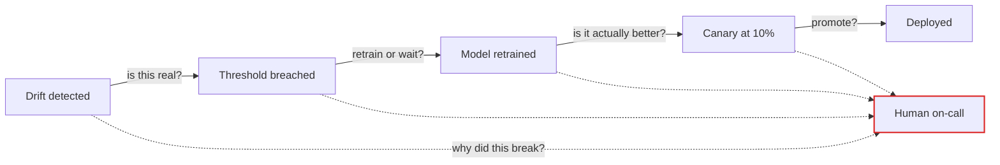
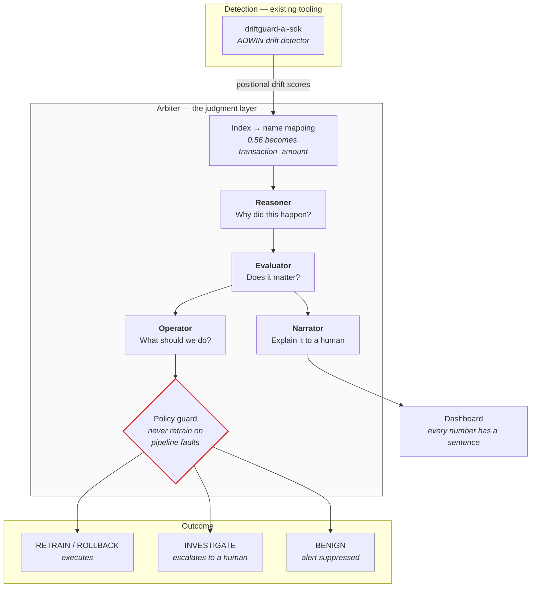
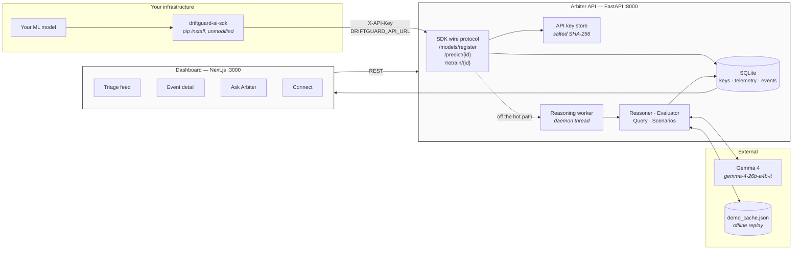
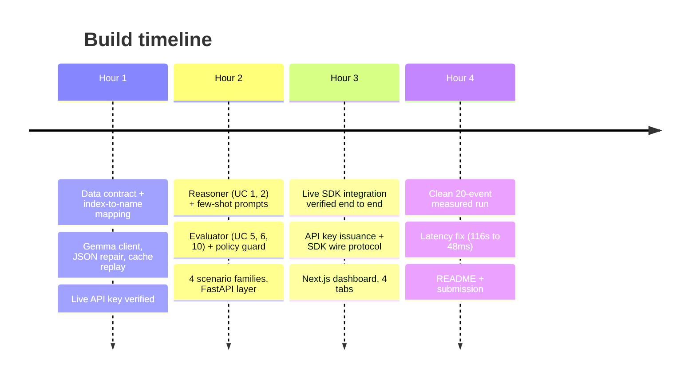
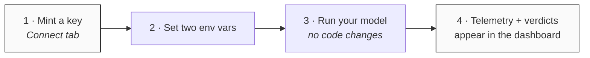

<div align="center">

# Arbiter
**AI judgment for production ML, powered by Gemma 4.**

Your monitoring tells you a number crossed a threshold.
Arbiter tells you *why*, whether it *matters*, and what to *do* about it.
[](./LICENSE)
[](https://www.python.org/)
[](https://nextjs.org/)
[](https://ai.google.dev/gemma)
[](./tests)

Built at **Hacktoberfest Hack Day — Coimbatore 2026** · INIT Club × iDEA Club × MLH

</div>

---

## Table of Contents

- [Project Title and Pitch](#project-title-and-pitch)
- [Team](#team)
- [Problem Statement](#problem-statement)
- [Solution](#solution)
- [Innovation and Differentiation](#innovation-and-differentiation)
- [Technical Implementation](#technical-implementation)
- [Implementation During the Hackathon](#implementation-during-the-hackathon)
- [Open Source and AI Usage](#open-source-and-ai-usage)
- [Setup and Usage](#setup-and-usage)
- [Challenges and Learnings](#challenges-and-learnings)
- [Credits and License](#credits-and-license)
- [Documentation](./docs/) — architecture, agents, modules, API, operations

---

## Project Title and Pitch

**Arbiter** is a reasoning layer for production ML operations. It sits on top of a drift
detector and supplies the judgment the detector cannot: *why* a model drifted, whether the
drift is *material*, and what *action* is warranted — using **Gemma 4**, an open-weight
model, over real production telemetry.

A drift detector fires when a score crosses a constant. That constant cannot tell a broken
upstream join apart from a genuine new customer segment, and it has no notion of whether
acting would help. Arbiter answers the questions a human on-call would otherwise answer
manually at 3am.

**Measured on a 20-event replay with hand-labelled causes** (reproduce with
`python -m arbiter.run_replay`):

| Metric | Result | What it means |
|---|---:|---|
| Alerts a fixed threshold fires | **20** | Every event crosses DriftGuard's `drift_threshold=0.15` |
| Judged actionable by Arbiter | **8** | Retraining or rollback genuinely helps |
| Suppressed | **12** | Real drift, but immaterial or not fixable by retraining |
| **Noise reduction** | **60.0%** | Pages a human did not receive |
| Escalated to a human | **5** | Confidence below the 0.60 floor, or evidence too thin |
| **Root-cause taxonomy accuracy** | **20/20 (100%)** | Against labels the model never sees |
| Narration quality bar | **20/20 on all 4 criteria** | Specific feature, magnitude, action, cause |

> Every number above comes from a real run against the live Gemma API. Arbiter refuses to
> report metrics when any verdict came from its offline fallback — see
> [Measurement honesty](#measurement-honesty).

---

## Team

**Team Last of Us**

| Member | Track | Contributions |
|---|---|---|
| **Bhavesh Madisetty** | Team Lead · Dashboard & API | Next.js dashboard (4 tabs, Vercel-style theme), API key issuance system, FastAPI layer, submission |
| **Yugendra N** | Core & Gemma integration | Gemma 4 client with JSON repair and cache replay, `.env` loading, live inference verification. Author of the `driftguard-ai-sdk` dependency (see [disclosure](#dependency-disclosure)) |
| **Nishanth R** | SDK integration & verification | Live `driftguard-ai-sdk` integration proof, positional `feature_scores` fix, end-to-end champion-model demo |

> A fourth member is joining; this table will be updated before final submission.

Commit history is public and every commit was authored during the Hack Day.

---

## Problem Statement

### The problem

MLOps tooling has automated the **mechanics** of handling model drift — detect, trigger,
retrain, deploy, roll back. It has not automated the **judgment** between those steps.
Every arrow in that pipeline still has a human on it:



A drift detector reduces to one decision rule: `drift_score > 0.15 → page someone`. That
rule is blind to the three things that actually determine what to do:

1. **Cause** — a broken upstream join and a genuine population shift produce nearly
   identical drift scores, but retraining fixes one and corrupts the model on the other.
2. **Materiality** — a 0.57 drift score with a 0.0007 accuracy change is not an incident.
   A 0.26 drift score with a 17-point precision drop is a serious one.
3. **Actionability** — some drift is simply not fixable by retraining, and retraining
   anyway wastes a compute cycle and a human's evening.

### Target users

ML engineers and on-call SREs who own models in production — the people who receive the
page, and who currently have to reconstruct the cause from dashboards at 3am.

### Why we selected it

One of our team members maintains an open-source MLOps drift-detection SDK on PyPI
(`driftguard-ai-sdk`). Building and operating it surfaced a wall in his own tool: it
reports *that* drift happened, fires a webhook, and leaves a human to work out the rest.
The SDK's own source concedes the gap — a magic `drift_threshold=0.15` constant standing in
for judgment, and champion/challenger comparison reduced to a single accuracy delta.

Alert fatigue is the consequence. When most pages turn out to be immaterial, engineers stop
reading them — and then miss the one that mattered. We chose this problem because we had
first-hand evidence of it, not because it sounded good in a pitch.

---

## Solution

Arbiter inserts a reasoning layer at each decision point, with Gemma 4 playing four roles.



### Gemma's four roles

| Role | Question it answers | Implementation |
|---|---|---|
| **Reasoner** | Why did this happen? | Causal hypothesis + drift taxonomy from telemetry (`reasoner.py`) |
| **Evaluator** | Is this material? | Judgment against evidence, not a threshold (`evaluator.py`) |
| **Operator** | What should we do? | Action selection with calibrated confidence (`evaluator.py`) |
| **Narrator** | What happened, for humans? | Prose narration + natural-language query (`query.py`) |

### Key features

**1 · Root-cause narration (UC 1)** — distinguishes a data-pipeline failure from a genuine
population shift from model decay. This distinction is the product: it determines whether
retraining helps or actively harms.

**2 · Drift taxonomy (UC 2)** — classifies each event as `covariate_shift`, `label_shift`,
`concept_drift`, `schema_break`, `seasonal`, or `upstream_bug`. **Measured 20/20 correct**
against hand-labelled causes.

**3 · Retrain-or-not gating (UC 5)** — replaces the magic `0.15` constant with reasoning.
This is where the 60% noise reduction comes from.

**4 · Champion vs. challenger judgment (UC 6)** — asks whether a retrained model improved
*on the segment that actually drifted*, not just overall. A challenger can gain globally
while regressing on exactly the population it was retrained for.

**5 · Action selection with confidence (UC 10)** — emits `RETRAIN` / `ROLLBACK` /
`INVESTIGATE` / `BENIGN`. Below a **0.60 confidence floor** the verdict escalates to a
human instead of executing, which is what makes automated action defensible at all.

**6 · Natural-language telemetry query (UC 11)** — *"which models degraded this week and
why?"* answered from the event corpus, with an explicit refusal when the data cannot
support an answer.

**7 · Drop-in SDK backend** — Arbiter implements the drift SDK's wire protocol, so
existing model code needs **no changes**: point two environment variables at Arbiter and
telemetry starts flowing.

**8 · Accounts and per-model workspaces** — sign in, mint your own API keys, and get a
dashboard scoped to your models. Selecting a model swaps the entire view: its metrics,
drift history, events, features and its own chatbot.

**9 · Two chatbot scopes** — a fleet-wide assistant that spans every model you own, and a
per-model one given that model's feature names, window statistics and verdicts, so it
answers with real magnitudes instead of generalities.

**10 · Gemma-written incident documentation** — one click produces a Markdown report for a
model: overview, every incident with the features and magnitudes involved, root-cause
patterns, recommended actions. The incident list is assembled in code and handed to the
model, so a report cannot contain an incident that did not happen.

**11 · API key rotation with rate-limit failover** — configure up to five Gemma keys and
Arbiter spreads calls round robin. A throttled key is parked for 60 seconds and the call
retries on the next, so one exhausted quota does not degrade the whole dashboard.

### Roadmap (not built — listed for completeness, not claimed)

Cross-feature correlation reasoning · fleet-wide triangulation · canary promotion
decisions · pre-retrain data-quality gate · LLM-as-judge on retraining outcomes · runbook
generation · incident post-mortems · compliance/audit narration.

---

## Innovation and Differentiation

### Against existing drift tooling

| Tool | Detects drift | Visualises | Reasons about **cause** | Judges **materiality** | Selects an **action** |
|---|:---:|:---:|:---:|:---:|:---:|
| Evidently | ✅ | ✅ | ❌ | ❌ | ❌ |
| Arize | ✅ | ✅ | ❌ | ❌ | ❌ |
| WhyLabs | ✅ | ✅ | ❌ | ❌ | ❌ |
| Fiddler | ✅ | ✅ | ❌ | ❌ | ❌ |
| **Arbiter** | via SDK | ✅ | ✅ | ✅ | ✅ |

Every existing tool stops at **detection and visualisation** — numbers and charts for a
human to interpret. None reasons about cause, materiality, or action. Arbiter is a
**reasoning layer, not another dashboard**, and it sits *on top of* a detector rather than
replacing one.

### Three things that make this more than an LLM wrapper

**1 · The alert that did not fire is the product.** Most AI features add output. Arbiter's
headline result is *subtraction*: 12 of 20 pages suppressed, each with a stated reason. The
dashboard prints **"DriftGuard would have paged on this"** on every suppressed card, which
makes the delta visible without a word of explanation.

**2 · A policy guard in code, not in a prompt.** Gemma is instructed never to retrain on
pipeline-corrupted data. Instructions are not controls, so the rule is also enforced in
code:

```python
# src/arbiter/evaluator.py
if verdict.action == "RETRAIN" and verdict.taxonomy in ("upstream_bug", "schema_break"):
    verdict.action = "INVESTIGATE"      # training on corrupt data bakes in the bug
    verdict.confidence = min(verdict.confidence, CONFIDENCE_FLOOR - 0.01)
```

Tested directly: a mocked Gemma response demanding `RETRAIN` at 0.95 confidence on an
`upstream_bug` is overridden to `INVESTIGATE`
(`tests/test_evaluator.py::TestPipelineFaultGuard`).

**3 · Measurement honesty, enforced structurally.** <a id="measurement-honesty"></a>
Arbiter ships an offline heuristic fallback so a demo survives a dead network. That
fallback derives its taxonomy from the same signals the test fixtures were built from — so
grading it against those labels scores the fixture generator against itself and trivially
returns ~100%.

That is not a result, so the code refuses to report it:

```python
# measure_suppression() returns reportable: False unless every verdict came from Gemma
"gemma_backed_decisions": gemma_backed,
"reportable": gemma_backed == total,
```

`measure_accuracy()` returns `None` rather than a number, the CLI prints
**`UNREPORTABLE RUN`**, and the dashboard shows a warning banner. We built this after a
degraded run produced a flattering "100% accuracy, 100% noise reduction" that would have
been very easy to paste into this README.

### Why Gemma, and why open-weight matters here

MLOps telemetry frequently cannot leave a VPC. Gemma 4's weights are **openly published**,
so the same model demonstrated here can be self-hosted inside a private network — the
reasoning layer does not force the data out. This deployment uses hosted inference of that
open-weight model; we do not claim to run weights locally.

---

## Technical Implementation

### Architecture



### Technology stack

| Layer | Choice | Why |
|---|---|---|
| Reasoning | **Gemma 4** (`gemma-4-26b-a4b-it`) via Google AI Studio | Open-weight requirement; MoE (~4B active) keeps latency and cost low |
| Backend | **FastAPI** + Uvicorn (Python 3.11+) | Keeps reasoning next to the SDK and the telemetry; async-friendly |
| Drift detection | **`driftguard-ai-sdk` 1.0.4** (unmodified pip dependency) | Real detector (River ADWIN) rather than a reimplementation |
| Store | **SQLite** (WAL mode) | A team can self-host this: one file, no server. WAL lets the dashboard read while telemetry writes |
| Dashboard | **Next.js 14** (App Router) + TypeScript + Tailwind + Recharts | Type-safe API contract; static export deploys to Vercel |
| Champion model (demo) | **scikit-learn** logistic regression | Measures the *real* accuracy cost of drift, not a simulated one |
| Tests | **pytest** — 96 passing | — |

### Major components

| Module | Lines | Responsibility |
|---|---:|---|
| `schema.py` | 231 | Data contract; **positional → named feature mapping** |
| `gemma_client.py` | 237 | Hosted Gemma, JSON repair, cache replay, degraded mode |
| `prompts.py` | 236 | System prompts + 3 few-shot examples with real feature names |
| `evaluator.py` | 371 | UC 5/6/10 — gating, challenger judgment, measurement |
| `scenarios.py` | 322 | 4 synthetic drift families with hand-labelled causes |
| `api.py` | 416 | FastAPI layer, 25 routes |
| `ingest.py` | 400 | SDK wire protocol, telemetry → DriftEvent |
| `keys.py` | 389 | API key issuance, SQLite store |
| `reasoner.py` | 201 | UC 1/2 — root cause, taxonomy, quality bar |
| `sdk_demo.py` | 255 | Live end-to-end integration proof |
| `query.py` | 146 | UC 11 — natural-language telemetry query |
| `run_replay.py` | 127 | CLI producing the measured numbers in this README |

Backend **~3,370 lines** across 14 modules · Dashboard **~1,820 lines** · Tests **665 lines**

### Important technical decisions

<details>
<summary><b>1 · The highest-value 10 lines: positional → named features</b></summary>

The SDK's `ADWINDriftDetector.get_status()` returns feature scores **positionally**, because
the detector is constructed with `num_features: int` and only ever sees a feature matrix:

```python
>>> detector.get_status()["feature_scores"]
[0.5642, 0.2674, 0.2496, 0.0582, 0.0248, 0.0193]     # a list. No names.
```

Gemma cannot say *"transaction_amount drifted"* from that — the best possible narration is
*"feature 0 drifted"*, which is worthless to an on-call engineer. Arbiter captures the
ordered feature names at SDK registration and maps them before any event reaches the model:

```python
named = map_feature_scores(status["feature_scores"], feature_names)
# {"transaction_amount": 0.5642, "merchant_category": 0.2674, ...}
```

Without this step the entire product thesis collapses. It is tested hardest of anything in
the codebase (`tests/test_schema.py::TestMapFeatureScores`).
</details>

<details>
<summary><b>2 · Arbiter issues its own API keys</b></summary>

Users do not request a credential from DriftGuard or any third party. The SDK reads its
backend address from a single environment variable, so Arbiter implements that wire protocol
and becomes a **drop-in backend**:

```bash
DRIFTGUARD_API_URL="http://localhost:8000"   # → Arbiter
DRIFTGUARD_API_KEY="ak_live_..."             # minted in the Connect tab
```

Keys are stored as **salted SHA-256 hashes**; the plaintext is returned once at creation and
is unrecoverable afterwards, so a leaked database leaks no usable credentials. Until the
first key exists Arbiter accepts unauthenticated telemetry, so a new user can see the
product work before learning the key flow; once any key exists, authentication is enforced.
</details>

<details>
<summary><b>3 · Reasoning must stay off the telemetry hot path</b></summary>

Reasoning costs **~25 seconds** (two Gemma calls). The SDK posts telemetry from a worker
thread with a **5-second timeout and 5 retries**
(`tracker.py:_telemetry_worker_loop`), so reasoning inline backs up that queue and
**silently drops telemetry**.

Measured before the fix: a drift-crossing POST took **115,949 ms**.

FastAPI's `BackgroundTasks` did not solve it — they run *synchronously* inside
`TestClient`, so the problem was invisible in tests while appearing fine in production
reasoning. Moving reasoning to a daemon thread makes behaviour identical in both:

| | Before | After |
|---|---:|---:|
| Drift-crossing POST | 115,949 ms | **48 ms** |
| Normal telemetry POST | 38 ms | 38 ms |
| Within SDK's 5s timeout | ❌ | ✅ |
</details>

<details>
<summary><b>4 · Gemma has no guaranteed JSON mode</b></summary>

Structured output is not documented for Gemma on the Gemini API, so malformed JSON is
expected traffic rather than an edge case. `repair_json()` handles each observed failure
mode and returns `None` rather than inventing a verdict:

| Input | Recovered |
|---|---|
| `{"action":"RETRAIN"}` | ✅ |
| ` ```json\n{...}\n``` ` | ✅ fences stripped |
| `Here is my analysis: {...} hope that helps` | ✅ object extracted from prose |
| `{"features":["a","b",],}` | ✅ trailing commas repaired |
| `I cannot answer that.` | → `None`, caller decides |
| `[1,2,3]` | → `None`, array would `KeyError` downstream |

All six cases are tested (`tests/test_gemma_client.py::TestRepairJson`).
</details>

<details>
<summary><b>5 · Narration quality is measured, not assumed</b></summary>

Generic output (*"drift was detected in several features; consider retraining"*) would kill
the product thesis, so the quality bar is checked programmatically on every narration:

1. Names a **specific feature**
2. Cites a **specific magnitude**
3. Assigns a **taxonomy**
4. **Distinguishes cause** (pipeline fault vs. population shift vs. decay)

Techniques that got us there: **three few-shot examples using real feature names** (worth
more than any amount of instruction), passing **reference vs. current mean/std/null-rate per
feature** so the model *can* cite numbers, `temperature=0.2`, and a pinned model ID.

Result: **20/20 on all four criteria.**
</details>

### A real verdict, from live SDK telemetry

```
ACTION      : RETRAIN
CONFIDENCE  : 0.92
TAXONOMY    : covariate_shift
FEATURES    : transaction_amount, merchant_category

REASONING:
  The drift is driven by a massive shift in transaction_amount (mean 201.6 to
  890.4) and merchant_category (mean 8.42 to 13.0). Since no nulls were
  introduced and the standard deviations remain stable, this is a genuine
  covariate shift in the population rather than a data pipeline failure.

QUALITY BAR:
  PASS  names_specific_feature      PASS  assigns_taxonomy
  PASS  cites_magnitude             PASS  distinguishes_cause
```

Note what the model ruled *out* and why — that reasoning is the difference between a useful
verdict and a chart.

---

## Implementation During the Hackathon

Everything in this repository was written during the Hack Day. The `driftguard-ai-sdk`
dependency is consumed unmodified via `pip` (see [disclosure](#dependency-disclosure)).



### What was built

| Component | Status | Evidence |
|---|---|---|
| Data contract + feature mapping | ✅ | 24 tests |
| Gemma 4 client (repair, cache, degraded mode) | ✅ | 16 tests, live inference verified |
| Root-cause narration + taxonomy (UC 1, 2) | ✅ | 20/20 taxonomy accuracy |
| Retrain gating + action selection (UC 5, 10) | ✅ | 60% measured noise reduction |
| Champion vs. challenger (UC 6) | ✅ | Segment-regression case tested |
| Natural-language query (UC 11) | ✅ | Live in the Ask tab |
| SDK drop-in backend + API keys | ✅ | 30 tests, live SDK verified |
| Next.js dashboard, 4 tabs | ✅ | `next build` type-checks clean |
| Latency fix (reasoning off hot path) | ✅ | 115,949 ms → 48 ms |

**96 tests passing.** Two genuine bugs were found by verifying rather than assuming — both
documented in [Challenges and Learnings](#challenges-and-learnings).

---

## Open Source and AI Usage

### Dependency disclosure <a id="dependency-disclosure"></a>

> Arbiter builds on **`driftguard-ai-sdk`** (PyPI v1.0.4) — an open-source MLOps
> drift-detection SDK authored by team member **Yugendra N** together with two
> collaborators outside this team (Selvaprakash V, kart-alt). It is consumed as an
> **unmodified third-party dependency via `pip install`**; no SDK source is vendored,
> forked, or edited in this repository. **All code in this repository was written during the
> Hack Day.**
>
> The SDK contains **no generative AI**. The reasoning layer — which is what Arbiter is —
> has no equivalent in it.

We state this prominently because `AGENTS.md` §5 forbids both claiming external work as
one's own *and* hiding significant dependencies. Naming the outside collaborators keeps the
attribution accurate.

### AI model

| Attribute | Value |
|---|---|
| Model | **Gemma 4** — `gemma-4-26b-a4b-it` (MoE, ~4B active params) |
| Provider | Google AI Studio / Gemini API (hosted inference) |
| Licence | [Gemma Terms of Use](https://ai.google.dev/gemma/terms) — **open weights** |
| Role | Root-cause reasoning, materiality judgment, action selection, narration, NL query |
| Settings | `temperature=0.2`, pinned model ID, system instruction per role |
| Alternative | `gemma-4-31b-it` (dense flagship) via `GEMMA_MODEL` |

**Open-weight claim, stated precisely:** Gemma 4's weights are openly published, which
satisfies the open-source/open-weight requirement and means this model *can* be self-hosted
inside a VPC. This deployment uses hosted inference. We do **not** claim to run weights
locally.

Gemma is used at four decision points, documented in [Gemma's four roles](#gemmas-four-roles).

### Open-source dependencies

| Package | Licence | Role |
|---|---|---|
| [`driftguard-ai-sdk`](https://pypi.org/project/driftguard-ai-sdk/) 1.0.4 | MIT | Drift detection (River ADWIN) |
| [`google-genai`](https://pypi.org/project/google-genai/) | Apache-2.0 | Gemma 4 API client |
| [FastAPI](https://fastapi.tiangolo.com/) · [Uvicorn](https://www.uvicorn.org/) · [Pydantic](https://docs.pydantic.dev/) | MIT · BSD-3 · MIT | API layer |
| [NumPy](https://numpy.org/) · [scikit-learn](https://scikit-learn.org/) | BSD-3 | Telemetry stats, demo champion model |
| [Next.js](https://nextjs.org/) · [React](https://react.dev/) | MIT | Dashboard |
| [Tailwind CSS](https://tailwindcss.com/) · [Recharts](https://recharts.org/) | MIT | Styling, charts |
| [pytest](https://pytest.org/) · [httpx](https://www.python-httpx.org/) | MIT · BSD-3 | Tests |

### Data

No external datasets. The 20-event replay corpus is **synthetic**, generated by
`src/arbiter/scenarios.py` with a fixed seed (`20261008`) so the measured numbers in this
README are reproducible. Each event carries a hand-labelled `ground_truth` cause that is
**never shown to the model** — it exists so accuracy claims trace to a real comparison.

### AI coding assistance

This project was developed with AI coding assistants (Claude Code), which `AGENTS.md`
explicitly permits. All architecture decisions, verification, and measurement were
team-directed; every claim in this README was verified by running the code.

---

## Setup and Usage

### Prerequisites

| Requirement | Version |
|---|---|
| Python | 3.11+ |
| Node.js | 18+ |
| Gemma API key | Free at [aistudio.google.com/apikey](https://aistudio.google.com/apikey) |

### Installation

```bash
git clone https://github.com/bhaveshmadisetty/hacktoberfest-hack-day-coimbatore-x-init-club-and-idea-club-team-lastofus.git
cd hacktoberfest-hack-day-coimbatore-x-init-club-and-idea-club-team-lastofus

# Backend
pip install -r requirements.txt

# Frontend
cd web && npm install && cd ..

# Configure
cp .env.example .env     # then add your GEMMA_API_KEY
```

### Environment variables

| Variable | Required | Default | Purpose |
|---|---|---|---|
| `GEMMA_API_KEY` | **yes** | — | Gemma 4 inference. Without it Arbiter runs in degraded mode and refuses to report metrics |
| `GEMMA_API_KEY_2..5` | no | — | Additional keys. Arbiter rotates round robin and fails over when one is rate limited |
| `GEMMA_MODEL` | no | `gemma-4-26b-a4b-it` | Model ID; `gemma-4-31b-it` for stronger reasoning |
| `ARBITER_DB` | no | `./arbiter.db` | SQLite store (keys, telemetry, events) |
| `ARBITER_KEY_SALT` | no | dev default | **Change in any shared deployment.** Rotating it invalidates every issued key |
| `ARBITER_PUBLIC_URL` | no | `http://localhost:8000` | URL shown in the dashboard's setup snippet |
| `ARBITER_CACHE` | no | `./demo_cache.json` | Gemma response cache, replayed offline |
| `ARBITER_CORS_ORIGINS` | no | `http://localhost:3000` | Allowed dashboard origins |

> `.env` is gitignored and must never be committed. Verify with
> `git log --all --name-only | grep -c "^\.env$"` → must print `0`.

### Running

```bash
# Terminal 1 — API
PYTHONPATH=src python -m uvicorn arbiter.api:app --reload --port 8000

# Terminal 2 — Dashboard
cd web && npm run dev
```

| Service | URL |
|---|---|
| **Dashboard** | **http://localhost:3000** |
| API | http://localhost:8000 |
| Interactive API docs | http://localhost:8000/docs |

Or with Docker Compose (config provided; the commands above are what we verified):

```bash
docker compose up --build
```

### Reproduce the measured numbers

```bash
PYTHONPATH=src python -m arbiter.run_replay            # the table at the top of this README
PYTHONPATH=src python -m arbiter.run_replay --verbose  # plus every narration
PYTHONPATH=src python -m arbiter.sdk_demo              # live SDK → Gemma integration proof
python -m pytest                                       # 96 tests
```

### Connect your own model



**Step 1** — open the dashboard's **Connect** tab and generate an API key. It is shown
once; copy it immediately.

**Step 2 & 3** — point the SDK at Arbiter. Your existing model code is unchanged:

```python
import os
from driftguard import DriftGuard

os.environ["DRIFTGUARD_API_URL"] = "http://localhost:8000"   # → Arbiter
os.environ["DRIFTGUARD_API_KEY"] = "ak_live_..."             # from the Connect tab

dg = DriftGuard(model_id="fraud-detector-v2", drift_threshold=0.15)
model = dg.wrap(my_model, feature_extractor=lambda x: x)

model.predict(features)          # telemetry streams to Arbiter

@dg.retrainer
def retrain():                   # Arbiter decides whether this should run at all
    return train_new_model()
```

**Step 4** — the model registers itself on first contact and appears in the dashboard with
live telemetry. Once drift crosses the threshold and enough samples have accumulated,
Arbiter reasons about it and the verdict appears in the triage feed.

> Send **named features** (via `feature_extractor` or the `features=` argument). Without
> names, narrations cannot cite specific features — the dashboard flags any model registered
> without them.

### Using the dashboard

Sign in (or create an account) at <http://localhost:3000>. Everything is scoped to the
account: its API keys, its models, its telemetry, its drift events. One account cannot see
another's data.

| Area | What it shows |
|---|---|
| **Overview** | Fleet metric row, a table of every connected model, and the **fleet-wide chatbot** — ask "which models degraded and why?" across all of them |
| **Model view** | Select a model in the left rail: its own metric row, drift-score history against its threshold, drift events with Gemma's narration, its registered features, a taxonomy breakdown, and **its own chatbot** scoped to that model's telemetry |
| **Settings** | Mint and revoke API keys, copy the connect snippet, change email or password |

**Two chatbot scopes, two contexts.** The per-model bot is given that model's feature
names, window statistics and verdicts, so it can answer "why did `transaction_amount`
drift?" with real numbers. The fleet bot gets one summary line per model — enough for
"which is worst?", and it says so rather than guessing when a question needs
feature-level detail it was not given.

Suppressed events print **"DriftGuard would have paged on this"**, which makes the
alert-fatigue delta visible without a word of explanation.

### Accounts and credential handling

| Credential | Storage | Notes |
|---|---|---|
| Password | PBKDF2-HMAC-SHA256, 600k iterations, per-user random salt | Standard library, so no native dependency. **A production deployment should move to Argon2id** — PBKDF2 is more GPU-friendly than a memory-hard KDF. Verified with a constant-time compare |
| Session token | SHA-256 hash, 14-day expiry | Opaque random token; the plaintext is never stored |
| API key | Salted SHA-256 | Returned once at creation and unrecoverable afterwards |

Changing an email **requires the current password** — a stolen session token alone must
not be enough to redirect future password resets. Changing a password invalidates every
session, including the one that made the change.

---

## Challenges and Learnings

### 1 · The plan was wrong about the SDK's output shape

Our build plan assumed `get_status()` lived on `DriftGuard` and returned
`feature_scores` as a dict (`{0: 0.94}`). Verifying against the installed package showed
both assumptions were wrong: it lives on **`ADWINDriftDetector`** and returns a
**positional list** (`[0.56, 0.27, ...]`).

`map_feature_scores()` called `.items()` and would have raised `AttributeError` on **every
real drift event** — the integration would have failed completely at demo time.

**Learning:** read the installed source, not the documentation or your own notes. We now
accept list, tuple, and mapping shapes, with four regression tests pinning the list path.

### 2 · A fast test can hide a production-breaking bug

Reasoning inline made a drift-crossing POST take **116 seconds**. We reached for FastAPI's
`BackgroundTasks` — and the tests still showed 116 seconds, because `BackgroundTasks` run
*synchronously* under `TestClient` while running after the response under Uvicorn.

Had we only tested through `TestClient` and shipped, the bug would have looked fixed. Had we
only tested through Uvicorn, we would never have seen it at all.

**Learning:** when a fix depends on *when* something runs, verify it where the timing
differs. A daemon thread behaves identically in both environments, so that is what we
shipped. **115,949 ms → 48 ms.**

### 3 · Our own fallback nearly produced a fabricated benchmark

Arbiter's offline heuristic exists so a demo survives a dead network. Running the replay
without a Gemma key produced **"100% taxonomy accuracy, 100% noise reduction"** — numbers
that look fantastic and mean nothing, because the heuristic derives its taxonomy from the
same signals the fixtures were built from. It was grading itself.

Those numbers were one copy-paste away from this README.

**Learning:** honesty is an engineering requirement, not a disposition. We made the code
enforce it — `reportable: false`, `taxonomy_accuracy_pct: None`, a CLI banner reading
`UNREPORTABLE RUN`, and a dashboard warning. A guarantee you have to remember is not a
guarantee.

### 4 · Numbers in the prompt are what make narration specific

Early narrations were vague — *"several features show drift"* — because vagueness was the
only honest response to the input. The prompt contained drift scores and nothing else; the
model had no magnitudes to cite.

Passing **reference vs. current mean, std and null-rate per feature**, plus three few-shot
examples using real feature names, moved output to: *"transaction_amount rose from a ref
mean of 240 to 890 (+271%) … no nulls appeared and no variance collapsed, so this is real
traffic, not corrupted traffic."*

**Learning:** a model cannot cite evidence it was never given. Three worked examples beat
any quantity of instruction, and small-magnitude features need adaptive decimal precision —
printing `debt_to_income` as `0.3 → 0.3` hides exactly the shift it is supposed to reason
about.

### 5 · The best demo result was a suppression, not an action

Our live SDK run produced `BENIGN` on a drift score of **0.57**. Initially that looked like
a weak demo. Then we measured the champion model's accuracy: **0.9953 → 0.9947**.

Gemma was right. The drift was real and immaterial, and a fixed `0.15` threshold would have
paged an engineer over a **0.0007** accuracy change.

**Learning:** the valuable output of a judgment layer is often the absence of an action.
This reframed how we present the product — suppression is the headline, not a footnote.

---

## Credits and License

### Credits

- **`driftguard-ai-sdk`** — Yugendra N (team member), Selvaprakash V, kart-alt. MIT.
  Consumed unmodified via `pip`. See [disclosure](#dependency-disclosure).
- **Gemma 4** — Google DeepMind. Open weights under the
  [Gemma Terms of Use](https://ai.google.dev/gemma/terms).
- **Event organisers** — INIT Club, iDEA Club, and Major League Hacking (MLH) for
  Hacktoberfest Hack Day Coimbatore 2026.
- All open-source packages listed in
  [Open-source dependencies](#open-source-dependencies), used under their respective
  licences.

### License

Released under the **MIT License** — see [LICENSE](./LICENSE).

---

<div align="center">

**Arbiter** · Team Last of Us · Hacktoberfest Hack Day Coimbatore 2026

*A drift detector tells you a number crossed a threshold.*
*The judgment about what to do with that is the part that was still manual.*

</div>
