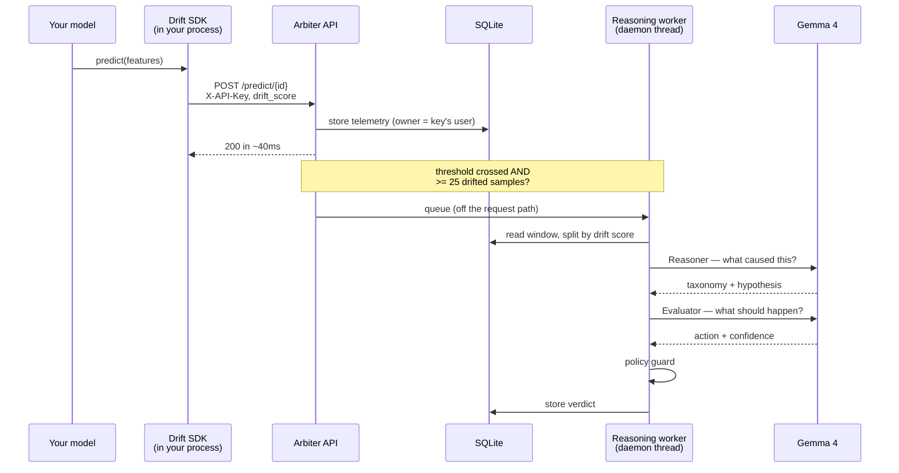

# Architecture

## How a prediction becomes a verdict



The response returns before reasoning starts. That is not an optimisation: the
SDK posts telemetry from a worker with a **5-second timeout and 5 retries**, and
reasoning takes roughly 25 seconds for two model calls. Doing it inline backs up
that queue and silently drops telemetry.

## Request flow by route group

| Group | Auth | Scope |
|---|---|---|
| `/auth/*` | none (issues sessions) | — |
| `/api/*` | `Authorization: Bearer <session>` | Filtered by `user_id` on every read |
| `/models/register`, `/predict/{id}`, `/retrain/{id}` | `X-API-Key` | Attributed to the key's owner |

The SDK routes sit at the root because the SDK builds those paths itself from
`DRIFTGUARD_API_URL` and cannot be told to use a prefix.

## Storage

One SQLite file, WAL mode so the dashboard reads while telemetry writes. A team
can self-host this without running a database server.

```mermaid
erDiagram
    users ||--o{ sessions : "has"
    users ||--o{ api_keys : "owns"
    users ||--o{ models : "owns"
    api_keys ||--o{ models : "registered by"
    models ||--o{ telemetry : "produces"
    models ||--o{ events : "reasoned into"

    users { int id PK, text email UK, text password_hash, text password_salt }
    sessions { text token_hash PK, int user_id FK, text expires_at }
    api_keys { int id PK, text key_hash UK, text key_hint, int user_id FK }
    models { text model_id PK, text features, real drift_threshold, int user_id FK }
    telemetry { int id PK, text model_id FK, real drift_score, text features, int user_id FK }
    events { text event_id PK, text model_id FK, text event_json, text verdict_json, int user_id FK }
```

`user_id` is on every data table and every read filters by it. Verified: a
second account sees 0 models and 0 events while the first holds 3 models.

Nothing stores a recoverable credential — passwords are PBKDF2-SHA256 with a
per-user salt, session tokens and API keys are stored as hashes.

## Window selection

The quality of a narration depends almost entirely on which rows are compared.

```
telemetry (newest first)
├── drift_score >= threshold  →  DRIFTED window ─┐
└── drift_score <  threshold  →  REFERENCE window ┴→ per-feature stats → Gemma
```

Three rules, each added after a failure observed in a real run:

1. **Split by drift score, not by position.** A 50/50 positional split assumes
   drift began halfway through the window. It rarely did, so drifted rows landed
   in the reference half and attribution became noise — a feature whose mean
   tripled scored 0.04 and the narration called the alert a false positive.
2. **Require at least 25 drifted samples.** Reasoning on the first crossing
   compared a full reference window against ~1 drifted row, averaging the signal
   away entirely.
3. **Cap the reference window at 3× the drifted one.** A 250-row reference
   against 25 drifted rows dilutes exactly the movement the narration should name.

Per-feature drift is then attributed from how far each feature moved in standard
deviations of its own reference window, plus any jump in null rate — the SDK
sends one global score per prediction, not per-feature scores.

## Concurrency

| Concern | Handling |
|---|---|
| Reasoning blocking telemetry | Daemon thread per event. `BackgroundTasks` was tried and rejected: it runs synchronously under `TestClient`, so the bug was invisible in tests |
| Duplicate reasoning | Event ID keyed on total telemetry count; an in-flight event is skipped |
| One model starving others | The in-flight check is **per model**. A global check meant the first model to drift starved the rest — 1 of 3 models got a verdict |
| SQLite across threads | One connection per thread, WAL mode |
| Shared key pool state | Lock-guarded round robin in `keypool.py` |

## Frontend

Next.js 14 App Router, TypeScript, Tailwind, Recharts, Geist. A single
client-rendered page: a left rail lists the account's models and selecting one
swaps the entire main pane. Drift is a property of a model, so every metric,
chart and chatbot on screen belongs to exactly one.

Session tokens live in `localStorage` and are attached by the API client, so no
call site handles auth. A 401 on an authenticated route clears the token and
returns the user to sign-in; a 401 on `/auth/*` is passed through as the real
credential error.
